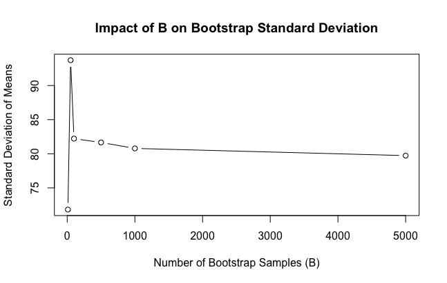

a# FEM11213---Data-Science-and-HR-Analytics
Student participating in the course FEM11213 - Data Science and HR Analytics

Input from Professor Kapoor: 
Consider the bootstrap loop we discussed: 

  B <- 1000
  mub <- c()
  for (b in 1:1000){
    samp_b <- sample.int(nrow(browser_totalspend), replace=TRUE)
    mub <- c(mub, mean(browser_totalspend$spend[samp_b]))
  }
  sd(mub)

Question 1: what is the importance of the number of bootstrap samples? 
Answer_EL:
1. Try out for different values of B:
B = 1000 --> sd [1] 83.78288
B = 500 --> sd [1] 82.56277
B = 10 --> sd [1] 78.81825
Hence, the lower B is set, the lower the sd received ceteris paribus. Hence, increasing the number of bootstrap samples (here B), the estimates derived become more precise and hence the standard deviation becomes smaller with a larger number of samples.
Also according to CLT, increasing the number of bootstraps, the distribution should converge towards the true distribution. Therefore, the number should at least be higher than the threshold of N = 30 (?).

# Create plot using following code

*Initialize an empty vector to store standard deviations
sd_values <- c()

*Specify a range of values for B
B_values <- c(10, 50, 100, 500, 1000, 5000)

*Loop over different values of B
for (B in B_values) {
  mub <- c()
  
*Perform the bootstrap procedure
  for (b in 1:B){
    samp_b <- sample.int(nrow(browser_totalspend), replace=TRUE)
    mub <- c(mub, mean(browser_totalspend$spend[samp_b]))
  }
  
*Calculate and store the standard deviation
  sd_values <- c(sd_values, sd(mub))
}

*Plot the results
plot(B_values, sd_values, type = 'b', 
     xlab = 'Number of Bootstrap Samples (B)', 
     ylab = 'Standard Deviation of Means',
     main = 'Impact of B on Bootstrap Standard Deviation')

# Output

Experimenting to learn about the effects of B is straightforward. You can write a loop that loops over B for various  values of B. Then you can investigate how the sd(mub) changes for each value of B. You can even plot this. I expect you to do something like this and then explain what it is that you learned from your experiments. 

Question 2: what happens when I set replace=FALSE? 
Here you would make this adjustment, see what happens, and then tell me what you learned. 

